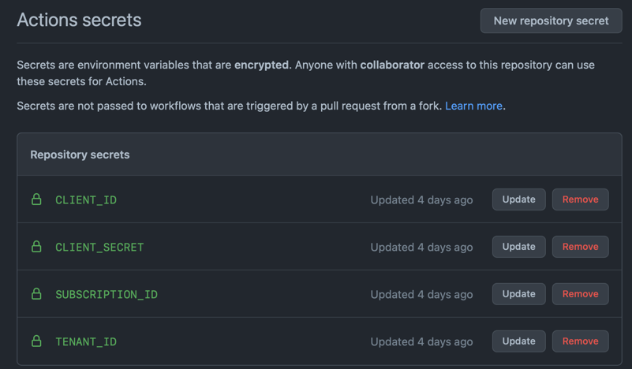

[](https://github.com/datarootsio/bikefitting/actions/workflows/terraform.yml)

# Terraform deployment

To deploy the Bikefitting application to Azure with Terraform, the following steps are needed:
1) Create a Service Principal and store the ID's and secrets to GitHub secrets.
2) Create the Terraform backend resources manually on Azure.
3) Create the resources with the Terraform scripts. (either manually or by using the terraform.yml pipeline)
4) Deploying the code to the different resources: using the multiple GitHub actions CI/CD pipelines.

## 1. Azure service principal +  GitHub Secrets

```
az ad sp create-for-rbac --name "sp-backend-tf" --role Owner --scopes /subscriptions/<subscription-id> --sdk-auth
```

Store the following four secrets in GitHub: 
- clientId => CLIENT_ID
- clientSecret => CLIENT_SECRET
- subscriptionId => SUBSCRIPTION_ID
- tenantId => TENANT_ID



## 2. Terraform backend on Azure
[Store Terraform state in Azure Storage](https://docs.microsoft.com/en-us/azure/developer/terraform/store-state-in-azure-storage?tabs=azure-cli)

```
az group create -g rg-backend-tf -l westeurope

az storage account create -n sabackendtf -g rg-backend-tf -l westeurope --sku Standard_LRS

az storage container create -n terraform-state --account-name sabackendtf
```

## 3. Terraform Deployment

Run terraform init to initialize Terraform locally.
Run the GitHub Action: terraform.yml pipeline to deploy on Azure.

MANUAL CHANGES: 
- Get Azure App Service webhook url from the Deployment center
- Set the Service URI in the webhook (found in the Azure Container Registry) to App Service Webhook URL

[This is not yet supported in Terraform](https://github.com/hashicorp/terraform-provider-azurerm/issues/9593)

See images:


